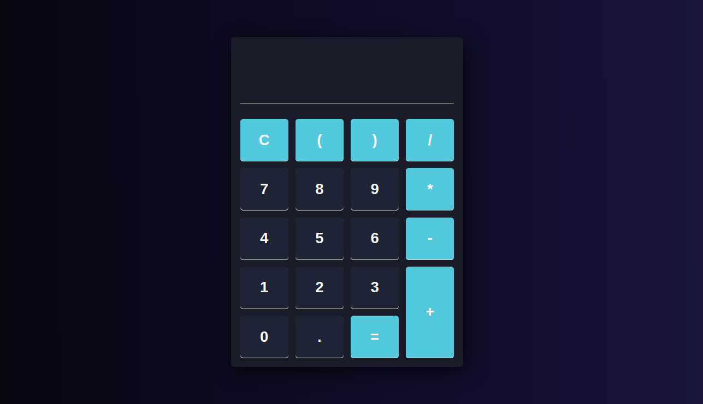

# Calculator App
The goal of this personal project is to create a basic calculator in HTML/CSS/JS

## Overview
### The project

#### User should be able to :
- Do basic arithmetic operations (+, -, *, /)
- Display result
- Reset calculator
- Be informed when trying to perform an impossible calculation, e.g. (50 *+ 2)

### Screenshot

## My Process
### Built with
- Vanilla JavaScript
- CSS3
- HTML5

## What I learned
1. How to use CSS Grid
2. Keydown & Error events
3. Native JS functions MAP & EVAL

## Author
- Frontend Developper - [@Rosales-Amael](https://www.linkedin.com/in/ama%C3%ABl-rosales-11237321a/)
